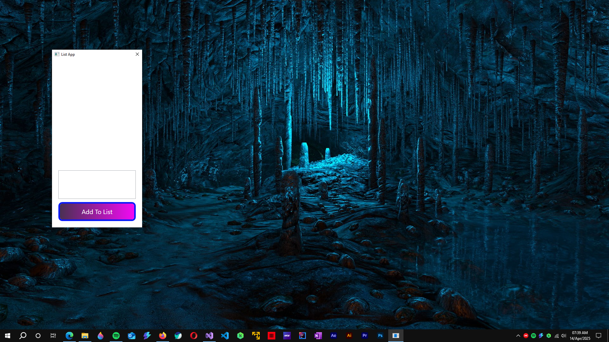
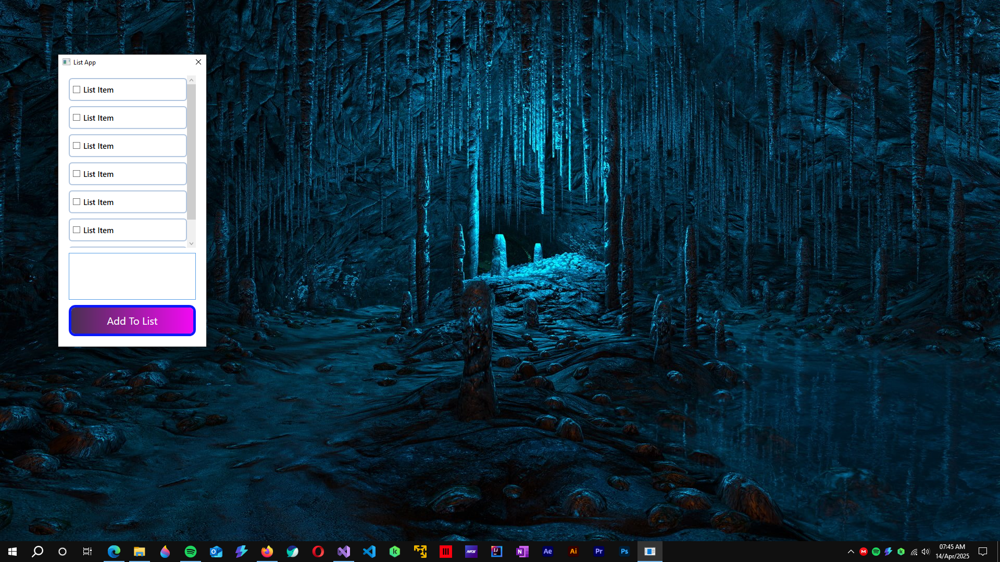

 
= ***List App 1***

== Project Status

....
Completed
....

'''

== Features

. Allows To Add And Delete Entry To The List.
. Efficiently handle memory by leveraging MVVM.

'''

== Technology Stack And Tools

[cols="1,1"]
|===
|Name|Version

|.Net Framework
|4.7.2

|Visual Studio Community 2022 
|17.13.6
|===

'''

== Install/Execute

TIP: Walkthrough Video Is Provided Inside Docs Folder

. Load The SLN File In Visual Studio
. Build Then Run IT

'''

== Gallery

====
****

****

****

****
====

'''

== Author

....
Mrigayan
....

